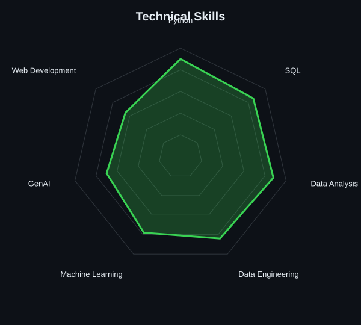

# OM ANIL BIRARI

### AI & Data Science Engineer · Data Analyst · Data Engineer · AI / ML

<p align="center">
  
</p>

<p align="center">
  <b>Building at the intersection of Data, AI, Engineering & Automation</b>
</p>

---

## 👨‍💻 About Me

Hi, I'm **Om Anil Birari**, an Artificial Intelligence and Data Science undergraduate building at the intersection of **Data, AI & Engineering**.

I focus on turning raw data into reliable insights and building practical, production-oriented solutions for extraction, validation, analysis, automation and intelligent decision-making.

- 🤖 AI & Machine Learning
- 📊 Data Analysis & Data Visualization
- 🐍 Python & SQL
- ⚙️ Data Engineering & ETL
- 🌐 Web Scraping & Automation
- 🧠 NLP & Generative AI
- 📈 Statistical Analysis & Predictive Modeling
- ☁️ Cloud & Data Platforms
- 🔍 Exploring Machine Learning, Deep Learning, NLP and GenAI foundations
- 🚀 Interested in building scalable, real-world AI and data products

---

## 🛠️ Tech Stack

<p align="center">


</p>

### Languages & Tools

`Python` · `SQL` · `HTML` · `CSS` · `JavaScript`

`Pandas` · `NumPy` · `Scikit-learn` · `Matplotlib`

`Git` · `GitHub` · `VS Code` · `Jupyter`

`Web Scraping` · `ETL` · `Data Analysis` · `Machine Learning`

---

## 📊 Skill Radar

<p align="center">
  
</p>

<p align="center">
  
</p>

---

## 💪 Data & Engineering Strengths

| Area | Skills |
|---|---|
| Data Analysis | Pandas, NumPy, Data Cleaning, Statistical Analysis, Data Visualization |
| Programming & SQL | Python, SQL, PostgreSQL, MySQL, SQLite |
| Data Engineering | ETL, REST APIs, Pipelines, Automation, Incremental Loads |
| AI & Engineering | Machine Learning, Deep Learning, NLP, Generative AI |
| UI & Web | HTML, CSS, JavaScript, Web Scraping, APIs |
| Uploads & Foundations | Data Sources, Databases, GitHub, Cloud |
| Tools & Platforms | Excel/Spreadsheets, Git, GitHub, VS Code, Jupyter, Google Colab |
| Strengths | Analytical Problem-Solving, Technical Documentation, Team Collaboration |

---

## 🚀 Featured Projects

### 1. Resume Web Scraper & Analyzer

An intelligent resume-processing project focused on extracting, cleaning and analyzing structured information from resumes.

**Focus:**  
`Python` · `Web Scraping` · `NLP` · `Data Extraction` · `Automation`

---

### 2. AI-Powered Data & Analytics Platform

A data-driven platform designed to combine data processing, analytics and AI-based insights into a practical engineering workflow.

**Focus:**  
`Python` · `Data Engineering` · `Machine Learning` · `Analytics`

---

### 3. Intelligent AI / ML Applications

Exploring practical applications of:

- Machine Learning
- Natural Language Processing
- Generative AI
- Data Analytics
- Automation
- Predictive Modeling

---

## 💼 Experience

### AI LEELA — Intern

**Nashik, Maharashtra · Jan 2026 – Mar 2026**

- Worked on a Deep Learning and Skill Development project.
- Developed production-oriented web applications using Python and FastAPI.
- Assisted with data collection, cleaning, preprocessing and structuring for application tasks.
- Integrated relevant APIs into application workflows.
- Worked toward transforming raw data and technical requirements into practical AI-enabled applications.

---

## 📈 GitHub Statistics

<p align="center">
  
</p>

<p align="center">
  
</p>

---

## 🐍 Contribution Snake

<p align="center">
  
</p>

---

## 🎯 Current Focus

```text
Data Analytics
      ↓
Data Engineering
      ↓
Machine Learning
      ↓
AI / NLP
      ↓
Generative AI
      ↓
Production AI Applications

📫 Connect With Me
<p align="center"> <a href="https://github.com/AIMaestrotheaum">  </a> </p>
📌 Profile Goals

Build practical AI and data solutions that solve real-world problems.

AI · Data · Engineering · Automation · Machine Learning

<p align="center"> <i>Learning → Building → Testing → Improving</i> </p> ```
