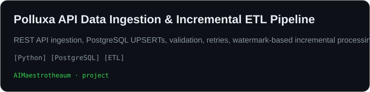
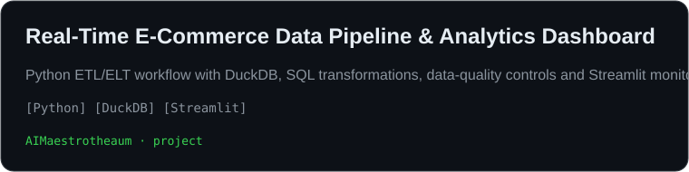
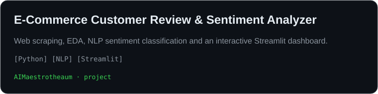
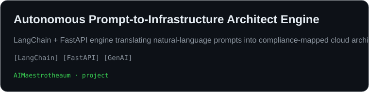
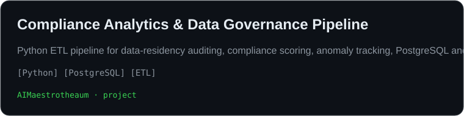

# OM ANIL BIRARI

### AI & Data Science Engineer · Data Analyst · Data Engineer · AI / ML

<p align="center">
  
</p>

<p align="center">
  <b>Building practical solutions at the intersection of Data, AI, Engineering & Automation.</b>
</p>

<p align="center">
  <a href="https://github.com/AIMaestrotheaum">
    
  </a>
  
  
  
</p>

---

## 👨‍💻 About Me

I'm **Om Anil Birari**, an Artificial Intelligence and Data Science undergraduate focused on building practical solutions across **Data Analytics, Data Engineering, Artificial Intelligence and Machine Learning**.

My work focuses on turning raw data into useful information and building systems that can **extract, clean, process, analyze and automate data-driven workflows**.

### What I work with

- 🤖 Artificial Intelligence & Machine Learning
- 📊 Data Analysis & Data Visualization
- 🐍 Python & SQL
- ⚙️ Data Engineering & ETL
- 🌐 Web Scraping & Automation
- 🧠 NLP & Generative AI
- 📈 Statistical Analysis & Predictive Modeling
- 🔌 REST APIs & Backend Development
- 🗄️ Databases & Data Processing
- ☁️ Cloud & Data Platforms

---

## 🛠️ Tech Stack

### Languages

<p align="center">
  
  
  
  
  
</p>

### Data & AI

<p align="center">
  
  
  
  
</p>

### Engineering & Tools

<p align="center">
  
  
  
  
</p>

---

## 📊 Skill Radar

<p align="center">
  
</p>

---

## 💪 Data & Engineering Strengths

| Area | Technologies / Skills |
|---|---|
| **Data Analysis** | Pandas, NumPy, Data Cleaning, Statistics, Visualization |
| **Programming** | Python, SQL, HTML, CSS, JavaScript |
| **Data Engineering** | ETL, Data Pipelines, REST APIs, Automation |
| **Machine Learning** | Scikit-learn, Predictive Modeling, Feature Engineering |
| **AI / NLP** | Machine Learning, NLP, Generative AI |
| **Web & APIs** | FastAPI, Web Scraping, REST APIs |
| **Databases** | MySQL, PostgreSQL, SQLite |
| **Tools** | Git, GitHub, VS Code, Jupyter, Google Colab |
| **Strengths** | Analytical Problem Solving, Technical Documentation, Collaboration |

---

# 🚀 Featured Projects

<p align="center">
  
</p>

### 01 — Resume Web Scraper & Analyzer

An intelligent resume-processing system focused on extracting, cleaning and analyzing structured information from resumes.

**Core Technologies**

`Python` · `Web Scraping` · `NLP` · `Data Extraction` · `Automation`

**Focus**

- Resume data extraction
- Information cleaning
- Structured data processing
- Automated analysis
- NLP-based processing

---

<p align="center">
  
</p>

### 02 — AI-Powered Data & Analytics Platform

A data-driven platform designed to combine data processing, analytics and AI-based insights into a practical engineering workflow.

**Core Technologies**

`Python` · `Data Engineering` · `Machine Learning` · `Analytics`

**Focus**

- Data processing
- Analytics
- AI-assisted insights
- Engineering workflows
- Automation

---

<p align="center">
  
</p>

### 03 — Intelligent AI / ML Applications

Exploring practical applications across modern AI and machine learning workflows.

**Areas**

`Machine Learning` · `NLP` · `Generative AI` · `Automation` · `Predictive Modeling`

---

<p align="center">
  
</p>

### 04 — Data Engineering & Automation

Building practical data workflows for collecting, transforming, processing and analyzing information.

**Areas**

`ETL` · `APIs` · `Data Pipelines` · `Web Scraping` · `Automation`

---

<p align="center">
  
</p>

### 05 — AI & Data Experiments

Continuous exploration of AI, data science and engineering concepts through practical implementations and experiments.

**Areas**

`Python` · `Data Science` · `AI` · `ML` · `Analytics`

---

# 💼 Experience

## AI LEELA — Intern

**Nashik, Maharashtra · Jan 2026 – Mar 2026**

- Worked on a Deep Learning and Skill Development project.
- Developed production-oriented web applications using **Python and FastAPI**.
- Assisted with data collection, cleaning, preprocessing and structuring.
- Integrated APIs into application workflows.
- Worked on transforming technical requirements into practical AI-enabled applications.

---

# 🧠 Current Learning & Focus

```text
Data Analytics
      ↓
Data Engineering
      ↓
Machine Learning
      ↓
AI / NLP
      ↓
Generative AI
      ↓
Production AI Applications
